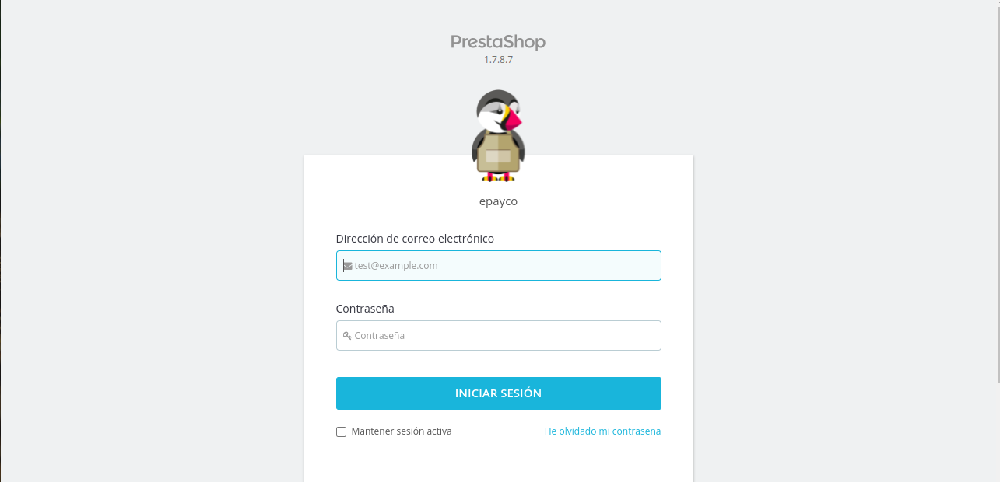
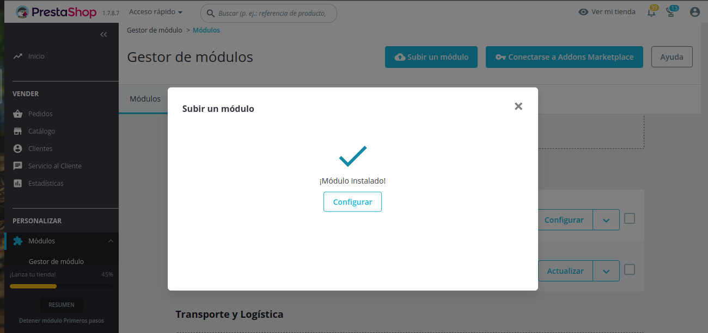

# plugin_prestashop_pagos_divididos
**Si usted tiene alguna pregunta o problema, no dude en ponerse en contacto con nuestro soporte técnico: desarrollo@payco.co.**

## Tabla de contenido

* [Versiones](#versiones)
* [Requisitos](#requisitos)
* [Instalación](#instalación)
* [Pasos](#pasos)

## Versiones
* [ePayco plugin plugin_prestashop_pagos_divididos v1.7.1.0](https://github.com/epayco/plugin_prestashop_pagos_divididos/releases/tag/v1.7.1.0).

## Requisitos

* Tener una cuenta activa en [ePayco](https://epayco.com/).
* Tener instalado PrestaShop v1.7.x
* Acceso a las carpetas donde se encuetra instalado PrestaShop.
* Acceso al admin de PrestaShop.

## Instalación

1. [Descarga el plugin.](https://github.com/epayco/plugin_prestashop_pagos_divididos)
2. Ingresar a tu administrador de PrestaShop.
3. Ingresa a Módulos y Catálogo de Módulos.
4. Carga el plugin en PrestaShop.
5. Buscar el plugin ePayco en la lista de módulos.
6. Haz click en Instalar.
7. Haz click en Seguir con la Instalación.
8. Ingresa al panel de clientes de ePayco para obtener el **P_CUST_ID_CLIENTE** y **P_KEY**.
9. configura el plugin de ePayco ingresando los datos del formulario y registrando los receivers con su respectivo valor de comisión
10. configurar el producto con el receivers correspondiente, añadiendo una nueva categoría en el producto y seleccionar "ePayco receiver" con el valor predefinido del id del receiver que recibirá la comisión de venta de ese producto

## Pasos

