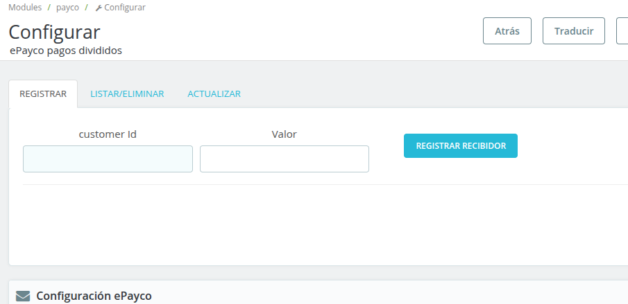
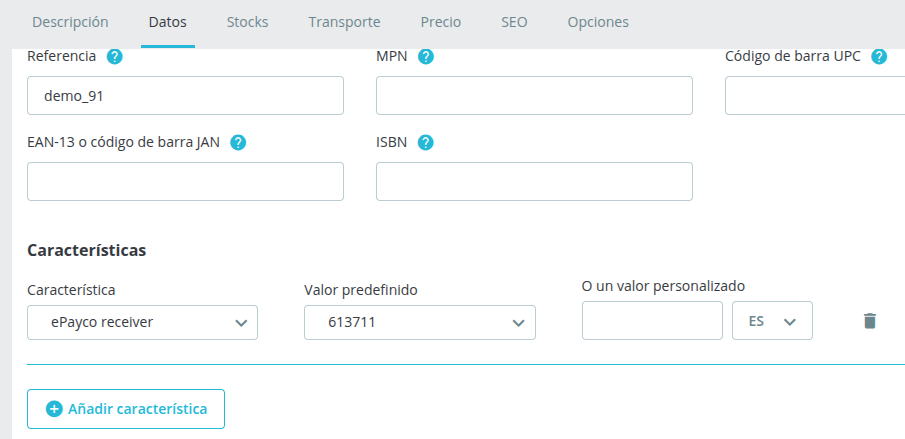

# Plugin PrestaShop Pagos Divididos

## Descripción

Este plugin permite gestionar pagos divididos en PrestaShop, facilitando a los comerciantes la distribución de pagos entre múltiples receptores. Es esencial que los usuarios creen receptores en su cuenta de ePayco y configuren correctamente las llaves de acceso.

## Tabla de Contenido
- [Versiones](#versiones)
- [Requisitos](#requisitos)
- [Instalación](#instalación)
- [Pasos](#pasos)

## Versiones

- ePayco plugin Pagos Divididos v1.8.0.1

## Requisitos

- Tener una cuenta activa en ePayco.
- Tener instalado PrestaShop v1.6.1.6 o superior.
- Acceso a las carpetas donde se encuentra instalado PrestaShop.
- Acceso al panel de administración de PrestaShop.

## Instalación

1. [Descarga el plugin.](https://github.com/epayco/plugin_prestashop_pagos_divididos).
2. Descomprimir el archivo descargado y luego comprimes la carpeta llamada payco.
3. Ingresa al administrador de PrestaShop.
4. Navega a **Módulos y Servicios**.
5. Carga el plugin en PrestaShop.
6. Busca el plugin ePayco en la lista de módulos.
7. Debes crear cada receptor o comercio registrado en tu cuenta de ePayco, con los cuales se dividirá el pago. 
8. Ingresa al panel de clientes de ePayco para obtener el `P_CUST_ID_CLIENTE`, `P_KEY`,  `PRIVATE_KEY` y  `PUBLIC_KEY`.
9. Configura el plugin de ePayco ingresando los datos del formulario.

## Pasos

1. **Crear receptores**: Asegúrate de crear los receptores necesarios en tu cuenta de ePayco antes de proceder.

2. **Configurar llaves**: Asegúrate de ingresar correctamente las llaves de ePayco en la configuración del plugin.
3. **Configurar Productos**: Ingresa al producto -> datos -> Añadir característica y completa los datos
- Caracteristica "ePayco receiver"
- Selecciona el recibidor asociado al producto como valor predefinido

4. **Realiza una prueba**: Una vez configurado, realiza una prueba de compra para verificar que los pagos se distribuyan correctamente.

Si tienes alguna pregunta o problema, no dudes en ponerte en contacto con nuestro soporte técnico: [desarrollo@epayco.com](mailto:desarrollo@epayco.com).

## Contacto

Para soporte técnico o consultas, puedes escribir a: desarrollo@epayco.com.
